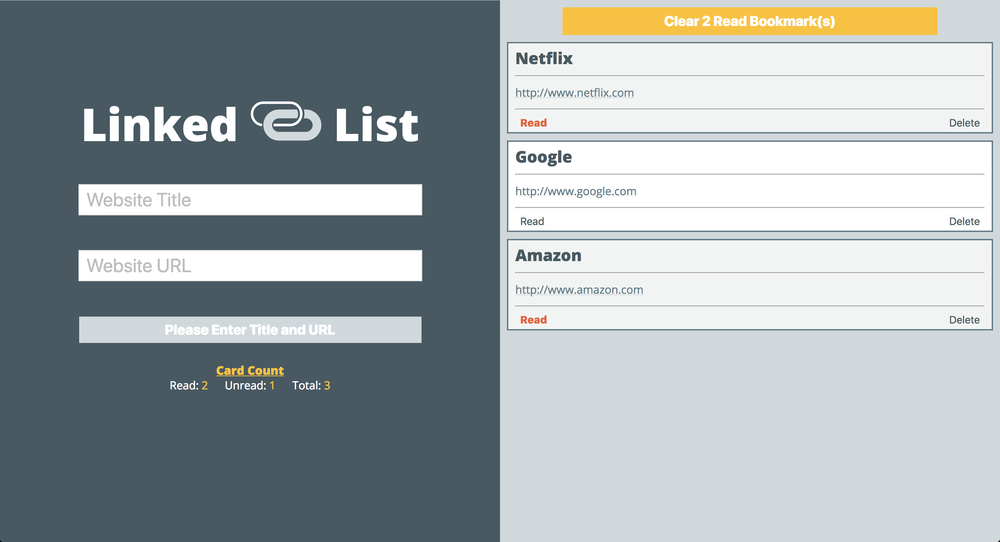

# Linked List - Alex Bonder, Ricardo Viera - (FE Mod 1)

## Synopsis

Linked List is an application that allows a user to save a list of urls to be read later. They can also click the 'read' button and will see styles indicating the bookmark has been read.

[Project Spec](http://frontend.turing.io/projects/linked-list.html)

## Project Goals

* Learn DOM manipulation
* Practice event bubbling
* Match the comp from the project spec
* Make the site responsive

## Installation

Fork or clone this project

Open `index.html`

## Screenshots

